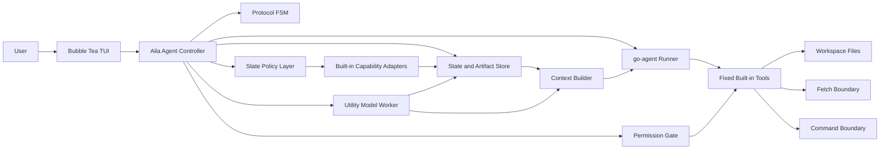
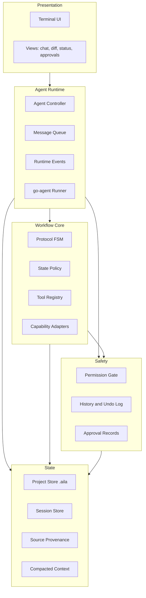
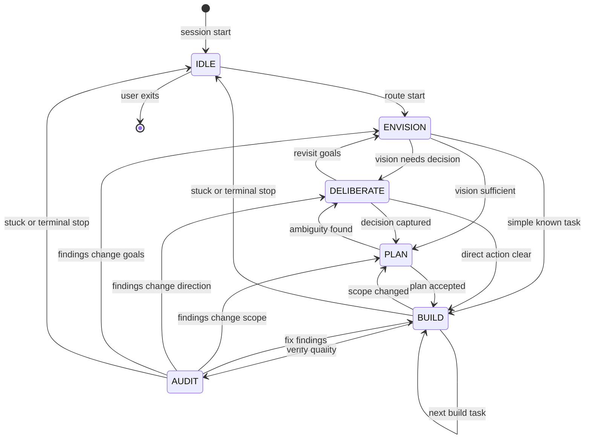
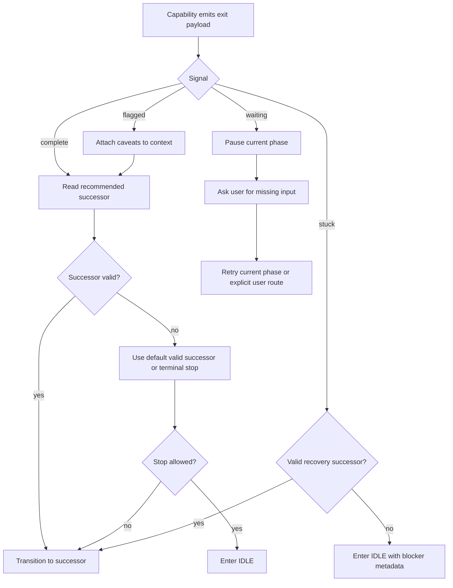
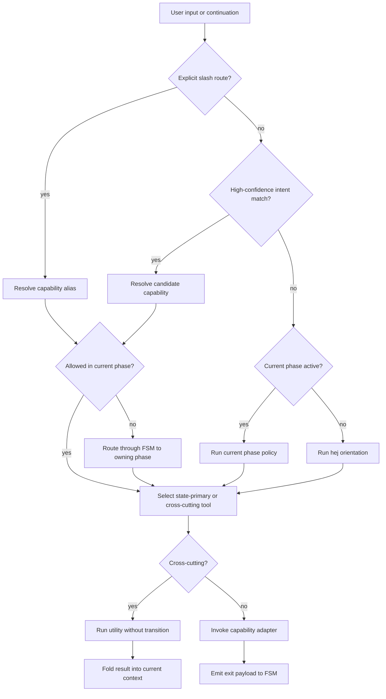
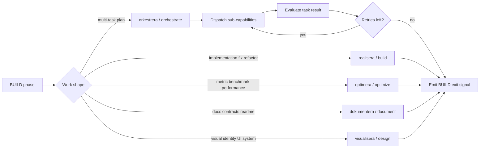
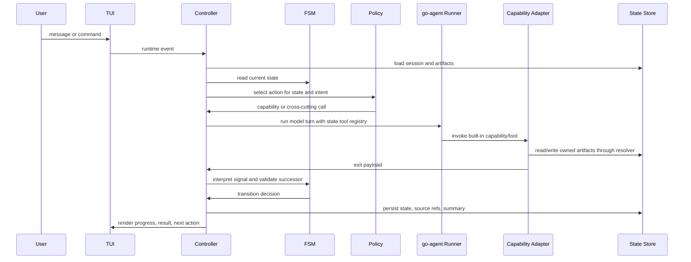
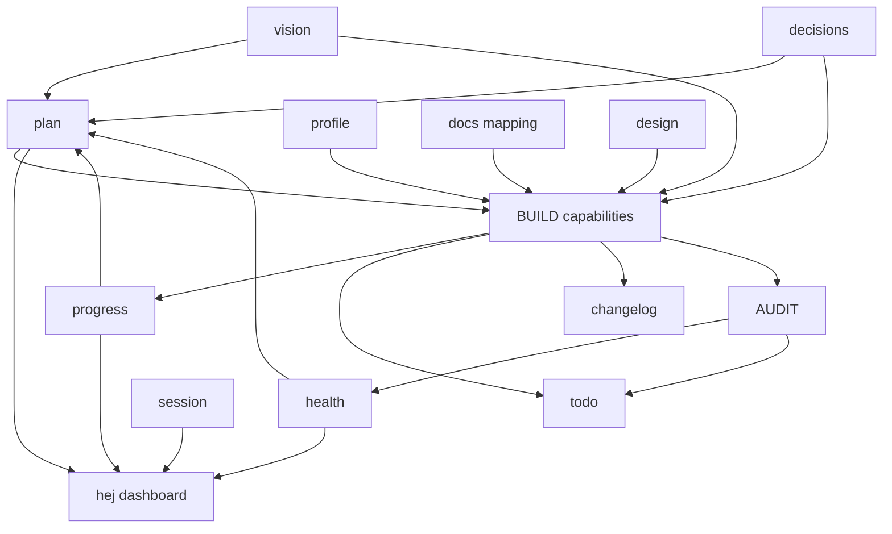
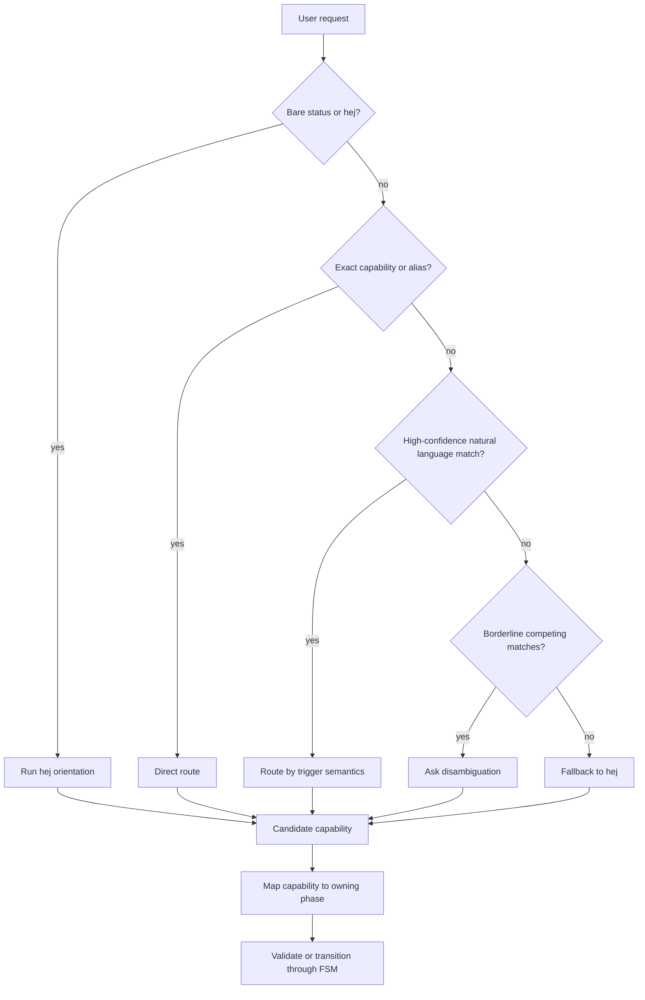
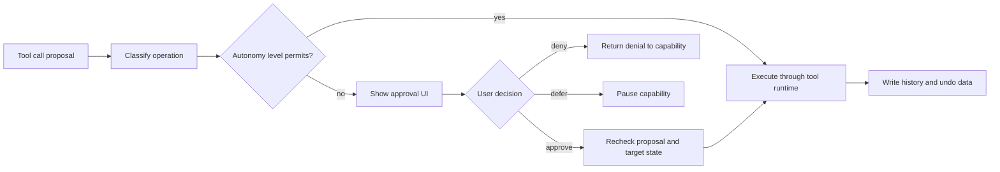

# Aila Reference Architecture

This document is the technical reference architecture for turning Agentera's capability protocol into Aila's built-in workflow. It is written for development: package boundaries, state rules, data contracts, and invariants should be testable from this document.

## Source Authority

The architecture is grounded in these sources:

| Source                                                                      | Role                                                                                     |
| --------------------------------------------------------------------------- | ---------------------------------------------------------------------------------------- |
| `README.md`                                                                 | Aila product intent, UX posture, fixed-tool philosophy, autonomy model, TUI expectations |
| `/home/jgabor/git/agentera/skills/agentera/protocol.yaml`                   | Authoritative phase model, exit signals, glyphs, severity, confidence, valid successors  |
| `/home/jgabor/git/agentera/skills/agentera/SKILL.md`                        | Agentera routing model, safety rails, artifact access conventions                        |
| `/home/jgabor/git/agentera/skills/agentera/capability_schema_contract.yaml` | Capability directory and schema contract, route aliases                                  |
| `/home/jgabor/git/agentera/skills/agentera/capabilities/*`                  | Capability behavior, artifacts, validation, and exit conditions                          |

If this document conflicts with `README.md` workflow details, this document is the development reference. The README is product-facing and should preserve the invariants listed in [README Alignment Checklist](#readme-alignment-checklist).

## Architectural Position

Aila is not an Agentera skill runner and does not support extensions, plugins, external MCP servers, or user-defined workflow modules. Aila embeds the Agentera workflow as a fixed, built-in product behavior.

The correct control model is hybrid:

| Concern                 | Mechanism                       | Reason                                                                                                        |
| ----------------------- | ------------------------------- | ------------------------------------------------------------------------------------------------------------- |
| Lifecycle authority     | Finite-state machine            | Agentera defines a finite phase graph with valid successors                                                   |
| Per-state action choice | Policy selector / behavior tree | Tool choice, retries, cross-cutting calls, and orchestration are conditional behaviors, not phase transitions |
| Capability execution    | Capability adapter              | Each capability owns its internal workflow and emits exactly one exit signal                                  |
| User steering           | Runtime event plane             | Queues, interrupts, slash commands, and approval prompts are host concerns, not Agentera phase transitions    |

The FSM is the spine. The policy layer is the muscle. Capability adapters are the organs. The TUI is the skin.

## System Context



### Component Responsibilities

| Component                | Owns                                                                            | Must not own                                            |
| ------------------------ | ------------------------------------------------------------------------------- | ------------------------------------------------------- |
| TUI                      | Rendering, keybindings, queued input, visible progress, diff/history views      | Phase decisions, file mutation, model prompts           |
| Agent Controller         | Session loop, event routing, model turn orchestration, capability invocation    | TUI layout, capability internals                        |
| Protocol FSM             | Current phase, valid successor validation, exit-signal interpretation           | Tool selection, user prompting, subagent internals      |
| State Policy Layer       | State-local behavior selection, tool exposure, retry/fallback policy            | Protocol validity, persisted artifacts                  |
| Capability Adapters      | Built-in workflows derived from Agentera prose and schemas                      | Runtime extensibility, arbitrary user plugins           |
| Tool Runtime             | Read/edit/write/bash/grep/find/fetch primitives, validation, result compression | Capability routing, state transitions                   |
| Permission Gate          | Autonomy checks, approval records, risky operation gating                       | UX rendering details, business workflow                 |
| State and Artifact Store | `.aila/` project state, session history, source provenance, artifact mapping    | Direct phase routing decisions                          |
| Utility Worker           | Idle-only prep, stale context checks, suggestions, safe compaction              | Foreground edits, silent state mutation, judgment calls |

## Layered Runtime



The runtime must keep these layers separable. For example, the TUI may show `BUILD -> AUDIT`, but it must not decide that transition. The FSM may approve `BUILD -> AUDIT`, but it must not decide whether `realisera` or `optimera` runs inside BUILD.

## Protocol FSM

The FSM has six states: one Aila state outside the protocol and five Agentera protocol phases.

| State        | Protocol phase | Primary capability family                                                                | Terminal by protocol | Self-transition |
| ------------ | -------------- | ---------------------------------------------------------------------------------------- | -------------------- | --------------- |
| `IDLE`       | none           | `hej` routing / no active capability                                                     | no                   | no              |
| `ENVISION`   | `envision`     | `visionera`                                                                              | no                   | no              |
| `DELIBERATE` | `deliberate`   | `resonera`                                                                               | no                   | no              |
| `PLAN`       | `plan`         | `planera`                                                                                | no                   | no              |
| `BUILD`      | `build`        | `realisera`, `optimera`, `dokumentera`, `visualisera`; `orkestrera` as conductor overlay | yes                  | yes             |
| `AUDIT`      | `audit`        | `inspektera`                                                                             | yes                  | no              |



### Valid Successors

The FSM must validate protocol-state transitions against `protocol.yaml`.

| From         | Valid successors                          |
| ------------ | ----------------------------------------- |
| `ENVISION`   | `DELIBERATE`, `PLAN`, `BUILD`             |
| `DELIBERATE` | `PLAN`, `BUILD`, `ENVISION`               |
| `PLAN`       | `BUILD`, `DELIBERATE`                     |
| `BUILD`      | `BUILD`, `AUDIT`, `PLAN`                  |
| `AUDIT`      | `BUILD`, `PLAN`, `DELIBERATE`, `ENVISION` |

`BUILD -> DELIBERATE` is not valid unless `protocol.yaml` is amended. If execution reveals a decision gap, route `BUILD -> PLAN -> DELIBERATE` or emit `waiting` for user direction.

### IDLE Semantics

`IDLE` is Aila's inert parking and routing state. It is not an Agentera phase and has no capability exit signal.

Enter `IDLE` when:

- a session starts and no phase has been selected yet
- the user explicitly resets or clears the session
- the current capability emits `stuck` and no valid in-protocol recovery is available
- a terminal phase has completed and autonomy or user preference says to stop instead of continuing
- the runtime cancels active work through an explicit user interrupt

Do not use `IDLE` as a lossy fallback. When entering `IDLE` because of a blocker, preserve the blocker, attempted actions, current phase, candidate successor, and artifact references in session state.

### Exit Signal Routing

Every capability emits exactly one protocol exit signal.

| Signal     | Meaning                          | FSM action                                                                                                               |
| ---------- | -------------------------------- | ------------------------------------------------------------------------------------------------------------------------ |
| `complete` | Work completed successfully      | Advance to a valid successor, or stop in `IDLE` if current phase is terminal and no next action is selected              |
| `flagged`  | Work completed with caveats      | Same routing as `complete`, but carry concerns into next context and visible UI                                          |
| `stuck`    | Hard blocker prevents completion | Prefer explicit recovery if payload recommends a valid successor; otherwise enter `IDLE` with blocker metadata preserved |
| `waiting`  | Missing input or decision        | Do not transition; pause current phase and ask for direction                                                             |

`waiting` is the single pause hatch for cases where no state transition is currently meaningful. It hands control to the agent runtime so the user can supply missing information. The current state is retained.



## Policy Layer

The policy layer is intentionally behavior-tree-shaped. It selects what to do inside a phase, but it does not own phase authority.



Rules:

- Cross-cutting calls never change FSM state by themselves.
- State-primary capability completion may request a successor, but the FSM validates it.
- The policy layer may recommend `BUILD -> PLAN`; it may not directly introduce `BUILD -> DELIBERATE` unless the protocol changes.
- The policy layer owns retries and fallback ordering, but the capability exit payload owns the factual result.

## Capability Map

Aila should render user-friendly English tool names, but internal identity should retain canonical Agentera capability names and protocol glyphs.

| Glyph | Capability    | Aila alias        | Phase relationship            | Purpose                                                         |
| ----- | ------------- | ----------------- | ----------------------------- | --------------------------------------------------------------- |
| `⌂`   | `hej`         | `status`, `brief` | cross-cutting / `IDLE` router | Orientation, dashboard, route suggestion                        |
| `⛥`   | `visionera`   | `vision`          | `ENVISION`                    | Project north star, principles, direction                       |
| `❈`   | `resonera`    | `discuss`         | `DELIBERATE`                  | Structured deliberation and decision capture                    |
| `⬚`   | `inspirera`   | `research`        | cross-cutting                 | External patterns, concepts, library analysis                   |
| `≡`   | `planera`     | `plan`            | `PLAN`                        | Work breakdown with dependencies and acceptance criteria        |
| `⧉`   | `realisera`   | `build`           | `BUILD`                       | Single implementation or fix cycle                              |
| `⎘`   | `optimera`    | `optimize`        | `BUILD`                       | Metric-driven experiments with locked harness                   |
| `▤`   | `dokumentera` | `document`        | `BUILD`                       | Documentation contract and docs alignment                       |
| `◰`   | `visualisera` | `design`          | `BUILD`                       | Visual identity and design systems                              |
| `⛶`   | `inspektera`  | `audit`           | `AUDIT`                       | Architecture, dependency, test, artifact, and health audit      |
| `♾`   | `profilera`   | `profile`         | cross-cutting                 | Decision profile from session corpus                            |
| `⎈`   | `orkestrera`  | `orchestrate`     | BUILD conductor overlay       | Multi-task plan execution, subagent dispatch, evaluation, retry |

### BUILD Dispatch

BUILD is the only composite phase.



`orkestrera` is a conductor, not a source-editing capability. It may dispatch workers, update plan status, request audits, and enforce retry budgets. It must not silently implement code itself.

## Turn Execution Sequence



## State And Artifact Model

Aila owns its project state. Runtime code should access logical artifacts through an artifact resolver rather than hardcoding paths.

Default target layout:

| Logical area                   | Default Aila path      | Notes                                                                                                                                        |
| ------------------------------ | ---------------------- | -------------------------------------------------------------------------------------------------------------------------------------------- |
| Project state                  | `.aila/`               | Aila-owned phase, session, summaries, source refs, tool history                                                                              |
| Human-facing project artifacts | project root           | Examples: `TODO.md`, `CHANGELOG.md`, `DESIGN.md` when Aila chooses to expose them                                                            |
| Agentera compatibility import  | `.agentera/`           | Source protocol uses `.agentera/`; Aila may read/import during development but should not make runtime behavior depend on raw Agentera paths |
| Global profile                 | `$XDG_DATA_HOME/aila/` | Aila-owned equivalent of Agentera's profile corpus                                                                                           |

Logical artifacts derived from Agentera:

| Artifact                    | Producer                               | Main consumers                                                                   |
| --------------------------- | -------------------------------------- | -------------------------------------------------------------------------------- |
| `vision`                    | `visionera`, bootstrap path            | `planera`, `realisera`, `inspektera`, `dokumentera`, `visualisera`, `orkestrera` |
| `decisions`                 | `resonera`                             | `planera`, `realisera`, `inspektera`, `profilera`, `optimera`, `orkestrera`      |
| `plan`                      | `planera`, `orkestrera` status updates | `realisera`, `inspektera`, `orkestrera`, TUI next-step hints                     |
| `progress`                  | `realisera`                            | `hej`, `planera`, `inspektera`, `dokumentera`, `visionera`, `orkestrera`         |
| `health`                    | `inspektera`                           | `hej`, `realisera`, `planera`, `orkestrera`                                      |
| `objective` / `experiments` | `optimera`                             | `optimera`, `hej` summaries                                                      |
| `docs`                      | `dokumentera`                          | all artifact consumers for path mapping and docs contracts                       |
| `design`                    | `visualisera`                          | `realisera`, `visionera`, frontend/UI work                                       |
| `profile`                   | `profilera`                            | most capabilities as preference/context signal                                   |
| `session`                   | Aila runtime                           | `hej`, context builder, continuation, compaction                                 |



### Artifact Resolver Contract

All artifact reads and writes go through a resolver:

```go
type ArtifactResolver interface {
    Resolve(ctx context.Context, logicalName string) (ArtifactPath, error)
}
```

The resolver must:

- prefer Aila's `.aila/` layout for native state
- understand any explicit mapping artifact Aila defines
- support importing or summarizing `.agentera/` state during development and migration
- return provenance with every resolved path
- reject writes to artifacts not owned by the invoking capability

## Capability Interface Contract

Capability adapters expose fixed, built-in workflows. They are not loaded dynamically at runtime.

```go
type Phase string

const (
    PhaseIdle       Phase = "idle"
    PhaseEnvision   Phase = "envision"
    PhaseDeliberate Phase = "deliberate"
    PhasePlan       Phase = "plan"
    PhaseBuild      Phase = "build"
    PhaseAudit      Phase = "audit"
)

type ExitSignal string

const (
    ExitComplete ExitSignal = "complete"
    ExitFlagged  ExitSignal = "flagged"
    ExitStuck    ExitSignal = "stuck"
    ExitWaiting  ExitSignal = "waiting"
)

type ExitPayload struct {
    Signal               ExitSignal
    Summary              string
    Concerns             []string
    Blocker              string
    NeededInput          string
    Attempted            []string
    RecommendedSuccessor Phase
    ArtifactRefs         []ArtifactRef
    SourceRefs           []SourceRef
}

type Capability interface {
    Name() string
    OwningPhase() Phase
    Run(context.Context, CapabilityRequest) (ExitPayload, error)
}
```

Implementation rules:

- A capability emits exactly one `ExitPayload` per invocation.
- Capability adapters may run internal workflows and subagents, but only the final exit payload reaches the FSM.
- Cross-cutting utilities return results to the current context and do not emit FSM exit payloads unless wrapped by a state-primary capability.
- If a capability needs user input, return `waiting` with `NeededInput`, not an invented intermediate state.
- If a capability cannot proceed, return `stuck` with `Blocker` and `Attempted` populated.

## Tool Registry Contract

The model must see only tools allowed for the current state plus global cross-cutting utilities. This is the main enforcement point that prevents prompt-level drift.

| FSM state    | State-primary tools                                      | Cross-cutting tools                                          |
| ------------ | -------------------------------------------------------- | ------------------------------------------------------------ |
| `IDLE`       | `brief` / `hej` routing only                             | `profile`, `research` as utilities when explicitly requested |
| `ENVISION`   | `vision`                                                 | `brief`, `research`, `profile`                               |
| `DELIBERATE` | `discuss`                                                | `brief`, `research`, `profile`                               |
| `PLAN`       | `plan`                                                   | `brief`, `research`, `profile`                               |
| `BUILD`      | `build`, `optimize`, `document`, `design`, `orchestrate` | `brief`, `research`, `profile`                               |
| `AUDIT`      | `audit`                                                  | `brief`, `research`, `profile`                               |

Tool exposure rules:

- `brief`, `research`, and `profile` never trigger phase transitions by themselves.
- `orchestrate` is exposed only inside BUILD.
- Source-editing tools are available only when the current capability and permission gate both allow them.
- Tool results should include compressed summaries plus exact source references when correctness may depend on the original output.

## Routing Model

Aila should preserve Agentera's five-layer dispatch semantics while implementing them as built-in routing, not as skill loading.



Primary aliases from Agentera are:

| Alias         | Capability    |
| ------------- | ------------- |
| `status`      | `hej`         |
| `vision`      | `visionera`   |
| `discuss`     | `resonera`    |
| `research`    | `inspirera`   |
| `plan`        | `planera`     |
| `build`       | `realisera`   |
| `optimize`    | `optimera`    |
| `audit`       | `inspektera`  |
| `document`    | `dokumentera` |
| `profile`     | `profilera`   |
| `design`      | `visualisera` |
| `orchestrate` | `orkestrera`  |

Slash routes and CLI/state commands are distinct concepts. A future `/agentera plan`-style route means "invoke planera". An `agentera plan` CLI command means "read plan state" in Agentera. Aila should avoid importing that ambiguity into its own CLI.

## Runtime Event Plane

Some events are not protocol transitions but still change what the user sees.

| Event                     | Runtime behavior                                    | FSM behavior                                                    |
| ------------------------- | --------------------------------------------------- | --------------------------------------------------------------- |
| User message while idle   | Route through policy                                | May enter a protocol state                                      |
| User message while active | Queue by default; optionally steer/interrupt        | No transition unless active capability exits or runtime cancels |
| Approval granted          | Resume pending tool/capability                      | No transition by itself                                         |
| Approval denied           | Return denial result to capability                  | Capability may emit `flagged`, `waiting`, or `stuck`            |
| Ctrl-C / explicit stop    | Cancel active work if safe, persist checkpoint      | Enter `IDLE` as runtime cancellation                            |
| Utility worker suggestion | Surface as hint                                     | No transition                                                   |
| Compaction                | Update conversation representation with source refs | No transition                                                   |

The event plane must preserve user trust: no hidden edits, no hidden long-running background jobs, no silent loss of source material.

## Utility Model Boundary

The utility model exists to prepare, not decide.

Allowed:

- context prefetch and ranking
- stale-context checks
- source condensation with exact provenance
- next-action suggestions with evidence
- safe compaction when the primary model is idle

Forbidden:

- file writes
- command execution with side effects
- git mutations
- hidden artifact changes
- final judgment on consequential tradeoffs
- state transitions without the controller and FSM

## Permission And Autonomy Boundary

Autonomy controls pace, not workflow shape.



Permission decisions must be tied to exact proposal data: operation kind, target path, target version, diff, command, working directory, expected effect, and approval identity. Recheck immediately before mutation.

## Package Boundary Sketch

These package names are a development sketch, not a public API commitment.

| Package               | Responsibility                                                    |
| --------------------- | ----------------------------------------------------------------- |
| `cmd/aila`            | CLI entrypoint, config loading, TUI/run mode startup              |
| `internal/app`        | Top-level application wiring                                      |
| `internal/tui`        | Bubble Tea models, views, keybindings, rendering                  |
| `internal/controller` | Session loop, event routing, model turn orchestration             |
| `internal/fsm`        | Phase state, transition table, exit-signal routing                |
| `internal/policy`     | State-local selectors and behavior-tree-like routing              |
| `internal/capability` | Built-in Agentera-derived capability adapters                     |
| `internal/tools`      | Fixed tool implementations and result compression                 |
| `internal/permission` | Autonomy levels, approvals, operation classification              |
| `internal/state`      | Project store, artifact resolver, session store, source refs      |
| `internal/context`    | Context builder, compaction, provenance, utility-prep integration |
| `internal/model`      | go-agent runner integration and model configuration               |

Hard boundaries:

- `internal/fsm` must not import `internal/tui`.
- `internal/capability` must not bypass `internal/state` for artifacts.
- `internal/tools` must not decide phase transitions.
- `internal/policy` may depend on FSM types, but must not mutate FSM state directly.
- `internal/tui` observes state through events/view models only.

## Testable Invariants

The implementation should include tests for these invariants:

1. The transition table exactly matches `protocol.yaml` valid successors plus explicit `IDLE` semantics.
2. Only BUILD self-transitions.
3. `BUILD -> DELIBERATE` is rejected unless the protocol table changes.
4. `complete` and `flagged` route through the same successor validation path, with `flagged` preserving concerns.
5. `waiting` does not change phase.
6. `stuck` preserves blocker metadata when parking in `IDLE`.
7. Cross-cutting tools never trigger transitions.
8. BUILD exposes `build`, `optimize`, `document`, `design`, and `orchestrate`; other phases do not.
9. `orchestrate` cannot directly edit files or run source-level checks except through dispatched capabilities/tools permitted by the controller.
10. Artifact writes require owning capability plus permission approval when applicable.
11. Utility model jobs cannot mutate workspace files, git state, or project artifacts.
12. TUI interruption and queued-message handling cannot leave a capability in an unobservable active state.

## Development Checklist

When implementing a new slice, check it against this list:

- Does it preserve Aila's fixed-product posture, with no plugin or extension surface?
- Does it use FSM transitions only for protocol phases?
- Does it keep behavior selection inside the policy layer?
- Does every capability completion produce exactly one exit payload?
- Does every artifact read/write go through the resolver?
- Does every mutation pass the permission gate and produce history/undo data where relevant?
- Does the TUI show active work, waits, blockers, and next actions without hiding state?
- Does compacted context keep exact source references for files, commands, diffs, errors, and user constraints?
- Does the implementation have tests for the relevant invariant above?

## README Alignment Checklist

The stale README items previously tracked here have been resolved. Keep the README aligned with these product-facing invariants:

- Link to this document as `docs/workflow-architecture.md`.
- Use the shared vocabulary: commands, tools, workflow capabilities, and utility capabilities.
- Treat `/review` and `/compact` as runtime commands, not tools or workflow capabilities.
- Keep utility capabilities hidden, background-only, and run by the utility model.
- Keep manual `/compact` separate from background continuous compaction.
- Preserve the canonical glyph map: `≡ plan`, `⧉ build`, `⛶ audit`, `⎘ optimize`, `◰ design`, `▤ document`, and `⎈ orchestrate`.
- Keep exit signals as signals, not fake states: `complete` and `flagged` route through valid successors, `waiting` pauses, and `stuck` preserves blocker metadata.
- Keep the primitive tool table aligned with `read`, `edit`, `write`, `bash`, `grep`, `find`, and `fetch`.
- Keep slash commands and `ctrl+x` shortcuts routed through the same command handlers.
- Keep autonomy values consistent as `off`, `read`, `write`, and `yolo`.

## Non-Goals

- Runtime loading of Agentera capabilities from disk.
- User-defined capability schemas.
- Generic plugin, hook, command-loader, provider-catalog, or marketplace APIs.
- Modeling every capability-internal step as a top-level FSM state.
- Using a behavior tree as the protocol authority.
- Hiding background work, hidden edits, or silent state changes.
